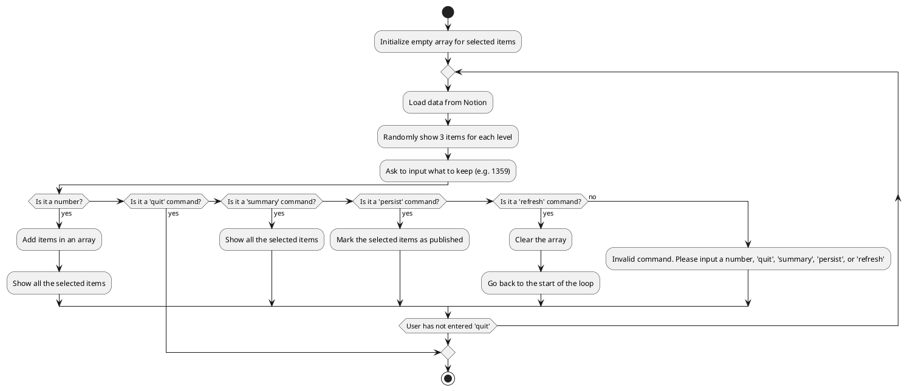

# Productivity-Community-Weekly-Tool

## Workflow

[Enable PlantUML diagram support in IDEA](https://www.jetbrains.com/help/idea/markdown.html#enable-diagrams)

```plantuml
@startuml
start
:Initialize empty array for selected items;
repeat
    :Load data from Notion;
    :Randomly show 3 items for each level;
    :Ask to input what to keep (e.g. 1359);
    if (Is it a number?) then (yes)
        :Add items in an array;
        :Show all the selected items;
    elseif (Is it a 'quit' command?) then (yes)
        break
    elseif (Is it a 'summary' command?) then (yes)
        :Show all the selected items;
    elseif (Is it a 'persist' command?) then (yes)
        :Mark the selected items as published;
    elseif (Is it a 'refresh' command?) then (yes)
        :Clear the array;
        :Go back to the start of the loop;
    else (no)
        :Invalid command. Please input a number, 'quit', 'summary', 'persist', or 'refresh';
    endif
repeat while (User has not entered 'quit')
stop
@enduml
```
